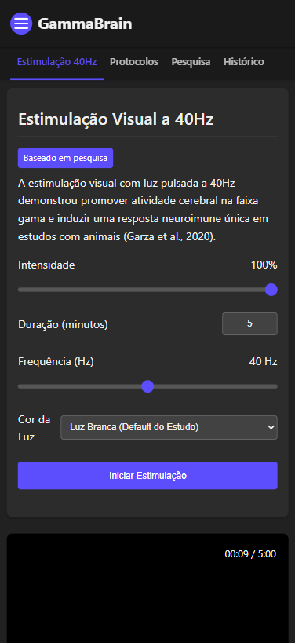

# GammaBrain

GammaBrain é um aplicativo web progressivo (PWA) para estimulação visual a 40Hz baseado em pesquisas científicas sobre a relação entre oscilações neurais gama e sinalização neuroimune. Esta aplicação permite a exposição controlada a luz pulsante a 40Hz, que estudos indicam poder promover vias de sinalização neuroimunes específicas potencialmente benéficas para a saúde cerebral.

## Base Científica

GammaBrain é baseado principalmente no estudo "Gamma Visual Stimulation Induces a Neuroimmune Signaling Profile Distinct from Acute Neuroinflammation" (Garza et al., 2020), publicado no Journal of Neuroscience. Esta pesquisa demonstrou que:

- A estimulação visual com luz pulsante a 40Hz ativa rapidamente vias de sinalização NF-κB e MAPK no cérebro
- Aumenta a expressão de citocinas específicas (M-CSF, IL-6, MIG, IL-4) que promovem estados microgliais fagocíticos
- Induz um perfil de sinalização neuroimune único, diferente da neuroinflamação aguda
- Tem potenciais efeitos neuroprotetores

Estudos adicionais como Iaccarino et al. (2016) e Adaikkan et al. (2019) também demonstraram que a estimulação a 40Hz pode reduzir a carga amiloide em modelos de Alzheimer e recrutar a micróglia para oferecer neuroproteção.

## Características

- **Estimulação Visual Precisa a 40Hz**: Implementa exatamente o ciclo de 25ms (12,5ms ligado, 12,5ms desligado) utilizado no estudo científico
- **Protocolos Baseados em Pesquisa**:
  - Protocolo NF-κB (15 min): Otimizado para ativação da via NF-κB conforme o estudo
  - Protocolo MAPK (60 min): Para ativação da via MAPK
  - Protocolo Inicial (5 min): Para usuários iniciantes
  - Protocolo Padrão (20 min): Equilibrado para uso regular
- **Controle de Intensidade**: Ajuste a intensidade luminosa conforme sua preferência
- **Opções de Cores**: Selecione entre luz branca (padrão do estudo), vermelha, azul ou verde
- **Modo Tela Cheia**: Maximiza a área de exposição à luz pulsante
- **Registro de Sessões**: Acompanhe seu histórico de estimulação
- **Interface Informativa**: Aprenda sobre a ciência por trás da estimulação visual a 40Hz

## Como Usar

1. **Instale o Aplicativo**:

   - Abra o arquivo index.html em um navegador moderno
   - Opcionalmente, instale como PWA através da opção "Adicionar à tela inicial" do seu navegador

2. **Escolha um Protocolo**:

   - Selecione um dos protocolos predefinidos ou
   - Personalize a duração e intensidade

3. **Inicie a Estimulação**:

   - Clique em "Iniciar Estimulação" para começar
   - Use o modo tela cheia para uma experiência mais imersiva (ESC para sair)

4. **Monitoramento e Acompanhamento**:
   - Acompanhe suas sessões na aba de Histórico
   - Adicione anotações sobre suas experiências

## Avisos de Segurança

**ATENÇÃO:** Este aplicativo é apenas para fins educacionais e experimentais. Não é um dispositivo médico certificado.

- **Não utilize em caso de**:

  - Epilepsia ou histórico de convulsões
  - Fotossensibilidade
  - Enxaqueca ou dores de cabeça sensíveis à luz
  - Problemas neurológicos ou oculares preexistentes

- **Recomendações de Uso**:
  - Pare imediatamente se sentir desconforto, tontura, dor de cabeça ou qualquer efeito adverso
  - Consulte um profissional de saúde antes de iniciar qualquer regime de estimulação visual
  - Limite as sessões iniciais a 5-10 minutos para avaliar sua tolerância

## Limitações Técnicas

- As telas de dispositivos comuns têm limitações técnicas para entregar com precisão a estimulação visual em comparação com equipamentos médicos especializados:
  - Os dispositivos variam significativamente na capacidade de luminância (lux)
  - O estudo original utilizou LEDs com luminância de 150 lux
  - Smartphones e monitores modernos geralmente produzem 300-800 lux no máximo
  - As assinaturas espectrais (distribuição de comprimentos de onda) diferem entre telas e LEDs
  - A taxa de atualização da tela pode afetar a precisão da estimulação a 40Hz

## Requisitos Técnicos

- Navegador web moderno com suporte a HTML5
- Chrome, Firefox, Safari ou Edge recentes
- Permissões para armazenamento local (localStorage) para salvar configurações
- Modo tela cheia disponível em desktop e dispositivos móveis

## Instalação

1. **Download**:

   - Baixe os arquivos do aplicativo para seu dispositivo

2. **Execução Local**:

   - Abra o arquivo index.html em seu navegador

3. **Instalação como PWA** (opcional):

   - No Chrome/Edge: Menu > Instalar aplicativo
   - No Safari (iOS): Compartilhar > Adicionar à Tela de Início

4. **Hospedagem Web** (opcional):
   - Os arquivos podem ser hospedados em qualquer servidor web
   - Não requer backend ou banco de dados

## Privacidade

- Todas as sessões e configurações são armazenadas localmente no seu dispositivo
- Nenhum dado é enviado para servidores externos
- Nenhuma informação pessoal é coletada

## Desenvolvimento

GammaBrain é desenvolvido em HTML, CSS e JavaScript puros, sem dependências externas.

## Licença

Este projeto é disponibilizado sob a licença MIT.

## Referências

- Garza, K. M., Zhang, L., Borron, B., Wood, L. B., & Singer, A. C. (2020). Gamma Visual Stimulation Induces a Neuroimmune Signaling Profile Distinct from Acute Neuroinflammation. Journal of Neuroscience, 40(6), 1211-1225.
- Iaccarino, H. F., Singer, A. C., Martorell, A. J., Rudenko, A., Gao, F., Gillingham, T. Z., ... & Tsai, L. H. (2016). Gamma frequency entrainment attenuates amyloid load and modifies microglia. Nature, 540(7632), 230-235.
- Adaikkan, C., Middleton, S. J., Marco, A., Pao, P. C., Mathys, H., Kim, D. N. W., ... & Tsai, L. H. (2019). Gamma entrainment binds higher-order brain regions and offers neuroprotection. Neuron, 102(5), 929-943.
